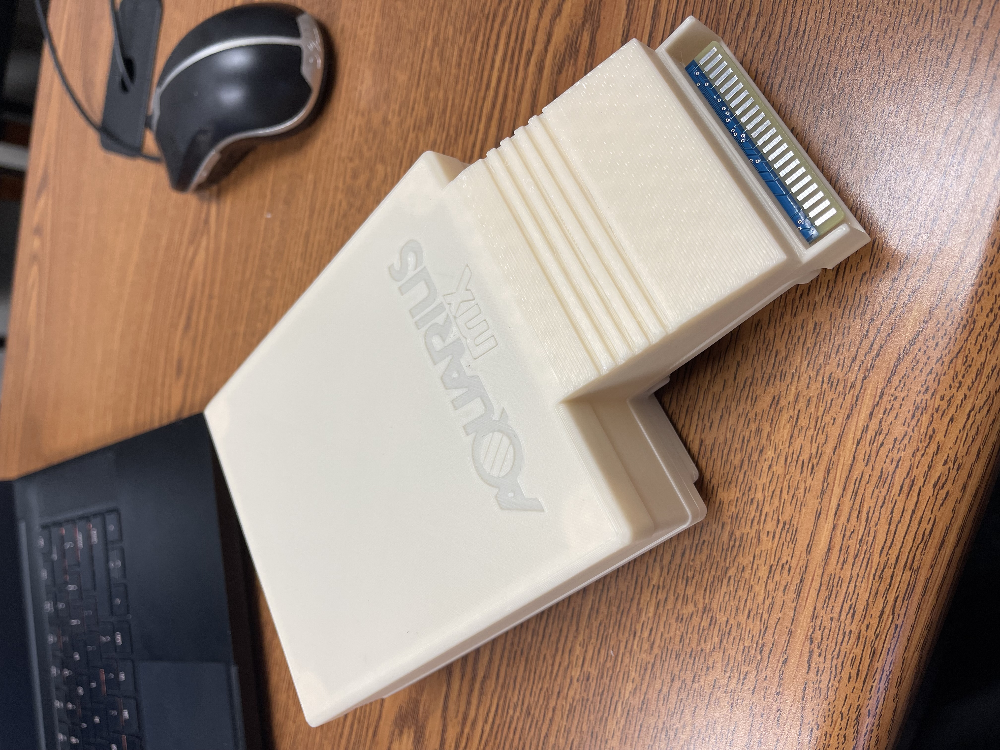

## Overview
The Aquarius MX system expander brings USB compatibility to the Aquarius Computer along with a 32K RAM expansion, and features all the functionality of Bruce Abbott's Micro Expander in an easy-to-build solution that fits the footprint of the Mini Expander.

## Features
- **USB Drive Port** - Reads and writes to USB drive, for quick access to games and programs
- **32k RAM** - Removes the need for a separate RAM expansion cartridge
- **Cartridge ROM Loading** - Quick loading/running of legacy Aquarius ROM cartridges through USB
- **AY-3-8910 Sound Chip** - Three voice PSG (Programmable Sound Generator) with Control Pad IO
- **PT3 Music Player** - Built-in retro music player
- **Aquarius Control Pad Inputs** - Standard DB9 connectors for attaching Aquarius Control Pads (internal header also available)
- **USB BASIC** - Enhanced commands for USB and IO devices to improve your BASIC programs
- **Classic Design** - Matches original Aquarius design aesthetic, in a device the same size as the Mini Expander: 210mm x 120mm x 55mm / 8.5" x 4.75" x 2.125"
- **Easy to Build** - Using standard through-hole components, this is an easy-to-make project for those who like to tinker in electronics
- **Open Source** - All components of this project are open source: make or modify them to your heart's content
- **Expandable** - System expansion port availble for future add-ons

## Status Updates
- **24 AUG 2022** - Most files have been uploaded and are actively being updated directly to the Repo. *At this time, we DON'T recommend ordering PCBs, 3D Printed cases, or components from the BOM until the prototype testing is complete (ETA 9/1/2022).*
- **23 AUG 2022** - GitHub Repository site created.
- **21 AUG 2022** - First prototype completed and tested locally. Others will be built and sent to designated testers through the end of AUGUST 2022.

## Build Process
1. Acquire the components - [Bill of Materials](https://docs.google.com/spreadsheets/d/1y7v0VCkjMdx25ugit28F5JhuhwDJofCVQUG5Ozl9IgA)
2. Program the ROM and Logic Chips
3. Assemble the PCB
4. Enclose components in the case
5. Format and configure USB drive

## GitHub Folder Structure
- **case** - components to make the 3D printed enclosure
- **docs** - system documentation, including schematics, board layout, and logo files
- **img** - image files used on this site
- **pcb** - files for making or modifying the PCB
- **software** - files for creating or updating the software used to run or control the Aquarius MX
- **src** - files for programming or modifying ROM and GAL logic chips

